# Module 5 Azure.

#### Homework: 
* 1. Create VNet, VM, Loadbalancer, IIS server via Azure Portal.
* 2. Create IIS server via ARM template.
* 3. Change IIS default start page (ARM template or custom script).

##### 5.1.1. Create VNet.

Create resource group "vnet_resource" and virtual network "vnet_for_hw".

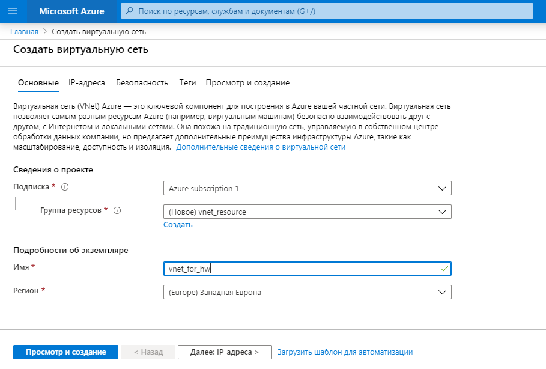

Configure IP addresses range 10.2.0.0/16 and subinterfaces 10.2.10.0/24 and 10.2.20.0/24.

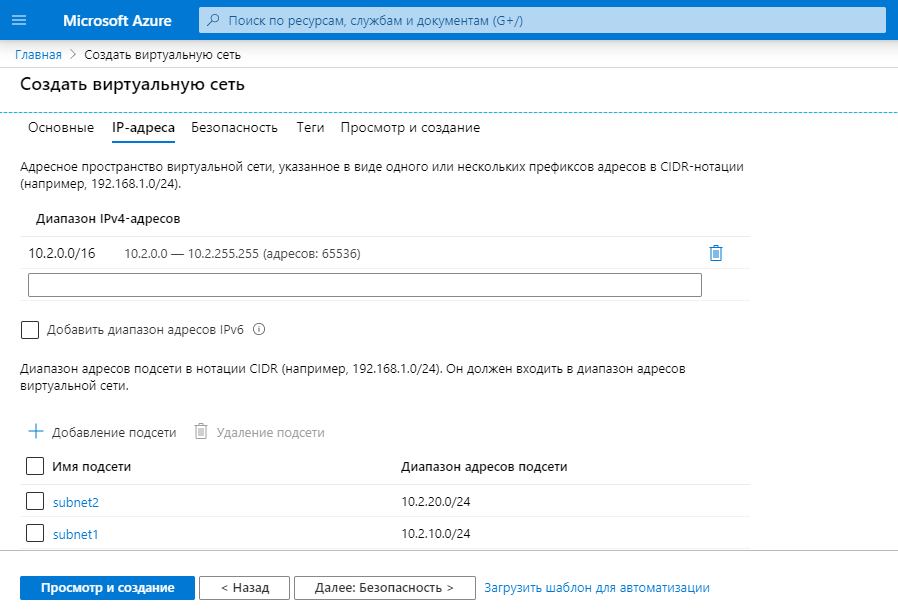

As a result we get:

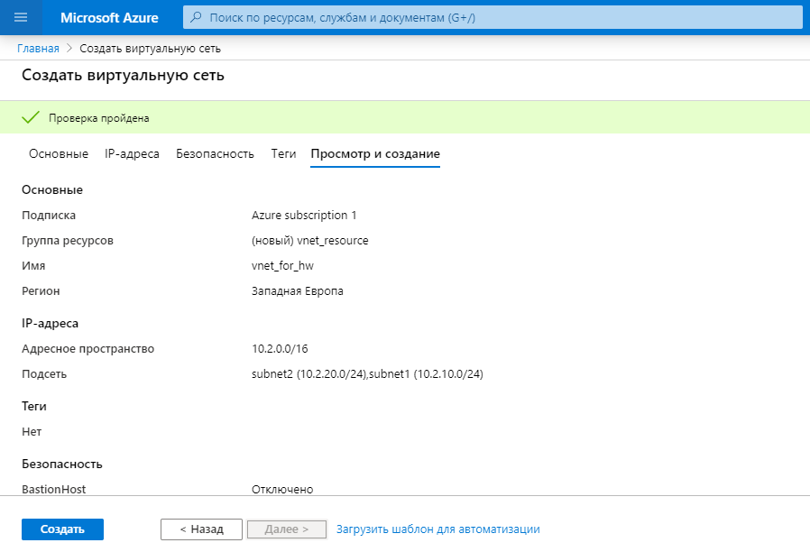

##### 5.1.2. Create VM.

Create in the resource group "Resource1" virtial machine "TESTPC1" with connection to her through SSH.

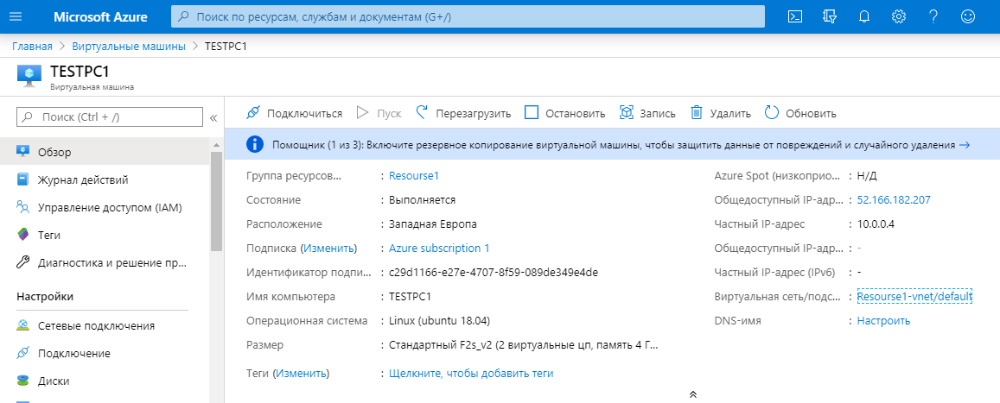

Connect to out VM through SSH.

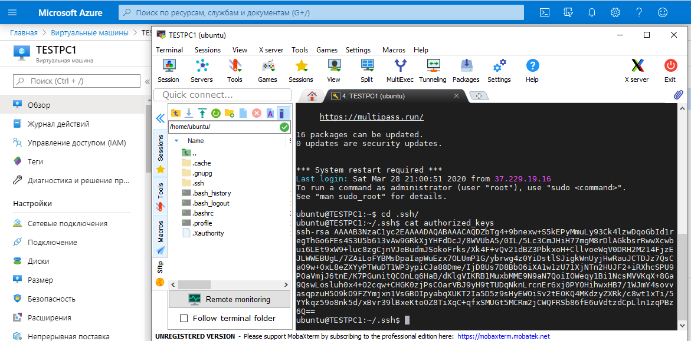

##### 5.1.3. Create Loadbalancer.

Create in resource group "Win" LoadBalancer "LB". 
In the other tabs, do not change anything.  
The numbers in the names of the created tools do not match, because the tools have already been created earlier and work correctly.

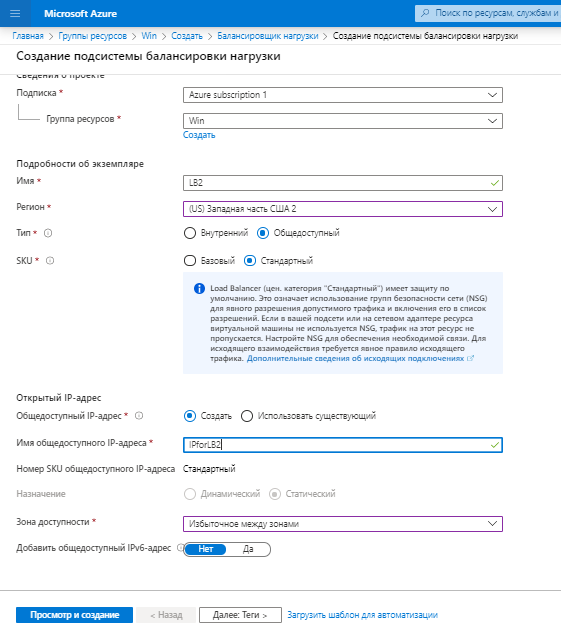

Create VM "Win2" in same region as LB.  
I could not choose "Size" at the moment, because there were no VM available in this region.

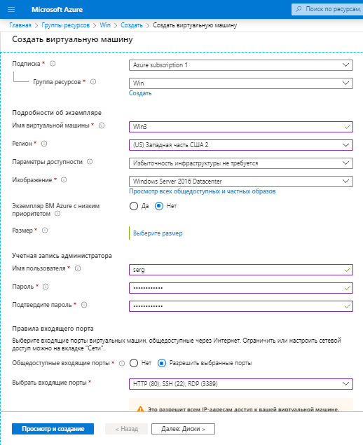

Configure network connections.

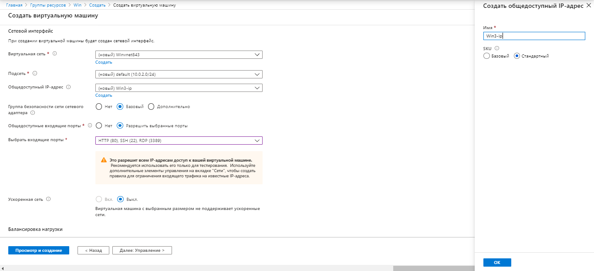

Configure LB on the same tab.  
Create server pool "pool_test2".

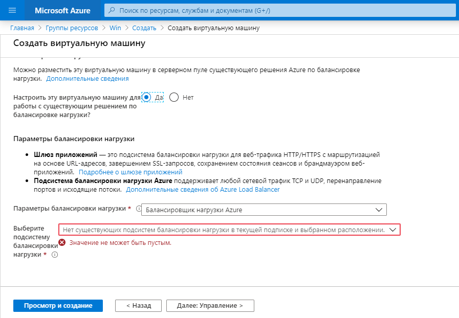

Connect to our VM "Win2".  
For install IIS in Power Shell run command  
    
    Install-WindowsFeature -name Web-Server -IncludeManagementTools

_________

Сontinue to configure LB.  
Create Health probes "Zond_test".

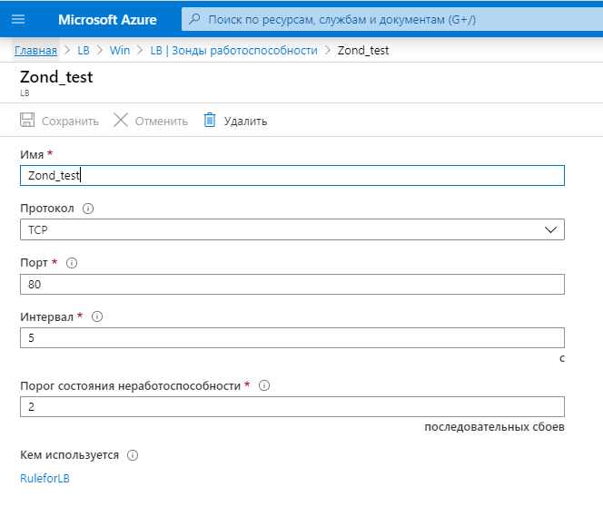

Create Load balancing rules "RuleforLB".

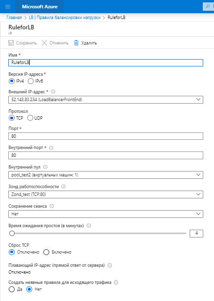

Check our configurations.  
Enter to IP VM (52.148.150.117) and IP LB (52.143.83.234).

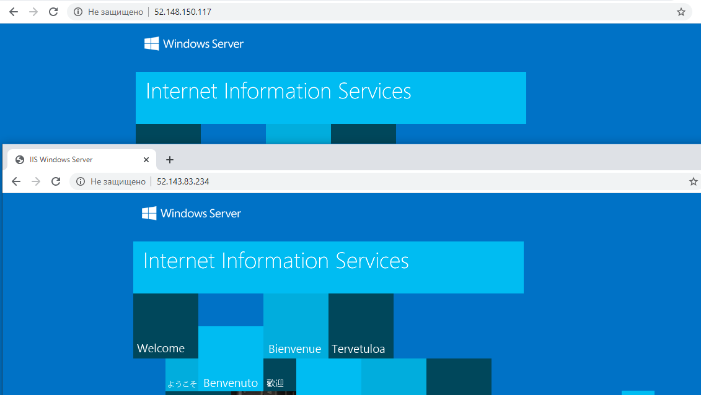

##### 5.1.4. Create IIS server via Azure Portal.

Create VM and install IIS on this VM.

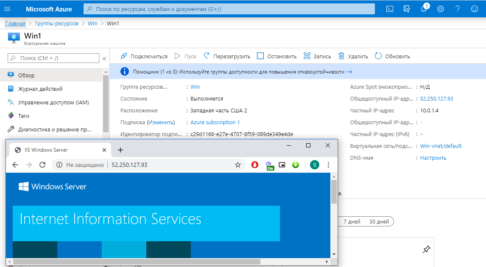

##### 5.2. Create IIS server via ARM template.

For deployment use next files:  
* template_for_IIS_original.json  
* parameters.json

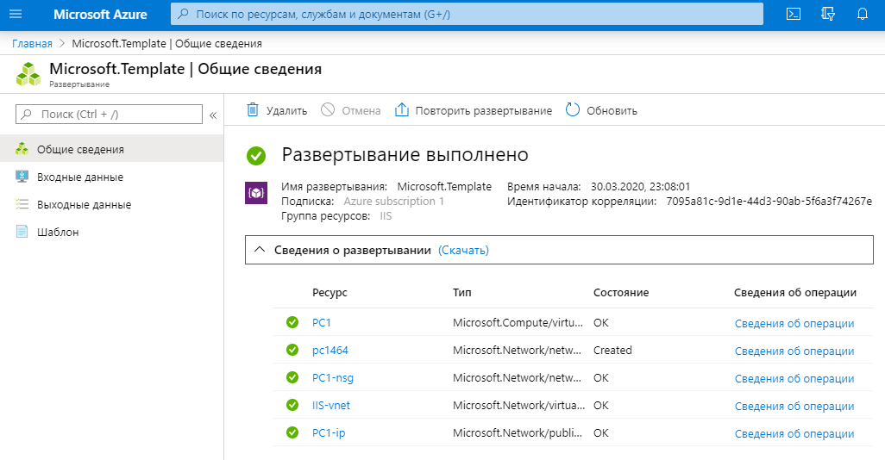

##### 5.3. Change IIS default start page (ARM template or custom script).

For deployment use next files:  
* template_for_IIS_non_original.json  
* parameters.json

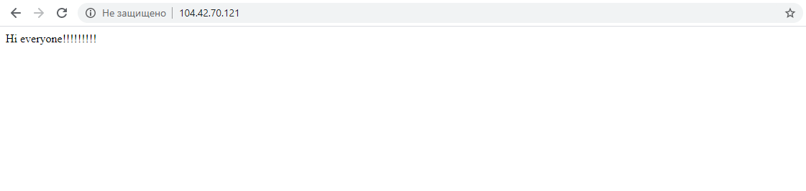

#### Links

    https://docs.microsoft.com/en-us/azure/load-balancer/tutorial-load-balancer-standard-manage-portal