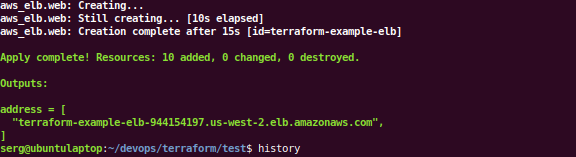
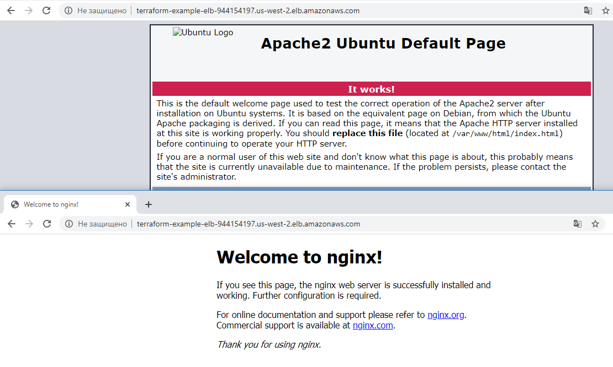

# Module 6 IaC. Terraform.

#### Homework: 
* Develop some minimal stack to deploy an infrastructure 
Acceptance Criteria:
* Your stack has 5-7 resource types and relations between. Your stack has sense and value.
* Task accepting format - Demo session starting with code review
* Your stack is able to plan/apply/destroy successfully
* We can see all activities in AWS Console in real time in parallel
* Using remote state is preferable (but not mandatory)
* English language is preferable (but not mandatory)

##### 6.1.1. Terraform installation.

    sudo apt-get install unzip

Confirm the latest version number on the terraform website:  

    https://releases.hashicorp.com/terraform/

or  

    https://www.terraform.io/downloads.html

    wget https://releases.hashicorp.com/terraform/0.12.18/terraform_0.12.18_linux_amd64.zip
    unzip terraform_0.12.18_linux_amd64.zip
    sudo mv terraform /usr/local/bin/
    terraform -v

The main is copy file "terraform" to /usr/local/bin.

##### 6.1.2. Terraform running.

Add AWS keys as environment variables (in terminal).

    export AWS_ACCESS_KEY=Your_AWS_ACCESS_KEY
    export AWS_SECRET_KEY=Your_AWS_SECRET_KEY

In work directory run next commands:  
Install needed plugins.

    terraform init

Check errors on terafform file.

    terraform validate

Run terraform file.

    terraform apply -auto-approve

-auto-approve # to run without confirmation  

Check for changes

    terraform plan

After that, 2 Instances will be launched at the AWS. Also will be launched VPC, subnet, LB and other.  
In terminal we see LB IP address.

Go to the LB address (the address is displayed in the terminal)

Removal of installed resources from AWS

    terraform destroy -auto-approve
