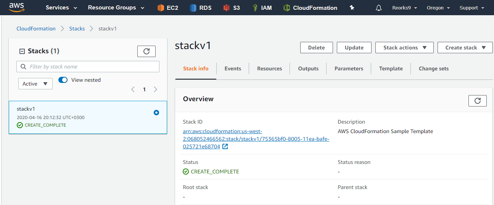

# Module 6. IaC. CloudFormation.

#### Homework: 
Create a yaml file which describes AWS stack to deploy (could be taken from Terraform task).  
Acceptance Criteria:
* Stack has at least one parameter with default value, with "Allowed values" option and Output.
* Task accepting format - Demo session starting with code review
* Your stack is able to be deployed and deleted successfully
* We can see all activities in AWS CF Console in real time in parallel
* We can check the Output value(s) in AWS Console
* English language is preferable (but not mandatory)

#### Template discription.

The template is above ("2 Instances and LB.yaml").  
AWS CloudFormation template consist of: Network resources (VPC, 2 subnet), SecurityGroup, 2 Instances, LoadBalancer.  

#### Environment deployment.

On the AWS page go to CloudFormation section.  
Click "Create stack". Click "Upload a template file". Choose our template. Click "Next".  
Enter the stack name in the field "Stack name". Choose needed parameters (Keys, Instance type, Environment). Click "Next" 2 times.  
Click "Create stack". Wait about 5 minutes.  
In result we should see the next. In the section "Stack info" status should be "Create complete".  
Also, 2 Instances and other resources will appear on the AWS page in the section "EC2".

In the section "Resources" lists all installed resources.
In the section "Outputs" we can see DNS address of the LB.

Click this DNS address and go to our LB. If press the button "refresh", then we'll see Nginx and Apache pages one by one.

#### Environment removal.

Now we can click the button "Delete" and all previously installed resources will be deleted.